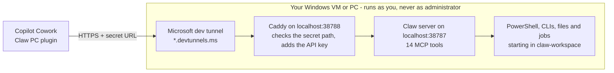

# 🐾 Claw PC for Copilot Cowork

### Let Microsoft 365 Copilot Cowork work on a real Windows machine: a virtual machine or your own PC.

Ask Cowork to run commands and PowerShell, build and test code, read and write files, and run
long jobs, straight from a Cowork conversation. One script to start it, one plugin to upload.

**[⬇️ Download](https://github.com/ogradyliam5/copilot-cowork-claw/archive/refs/heads/main.zip)** ·
[Test it](docs/testing.md) · [Troubleshooting](docs/troubleshooting.md) · [Security](docs/security.md)

> [!WARNING]
> While Claw PC is running, Cowork can do anything the Windows account running it can do: read
> and change files, run programs, and use whatever that account is signed in to. So can anyone
> who gets your secret URL. That's why a virtual machine is recommended (see
> [Where to run it](#where-to-run-it)). Keep the plugin private, stop Claw PC when you're not
> using it, and read the [security notes](docs/security.md) first.

## Why it's useful

Cowork already knows your work: your email, meetings, chats and files. What it can't do on its
own is use a real computer. Claw PC gives it one, so Cowork can go from "here's what we need" to
actually doing it.

- **Your context, real results.** Cowork can read a bug report in your inbox, reproduce it, fix
  it and run the tests. Then it can draft the reply with what it found.
- **Your tools.** Git, Node.js, Python, .NET, the Azure CLI, the Power Platform CLI: if it runs on
  Windows, Cowork can use it, and it can install what's missing.
- **Long jobs are fine.** Builds, installs and test runs happen in the background while Cowork
  checks on them, so they don't hit Cowork's time limit.
- **One plugin, not a connector per task.** 14 general tools (commands, PowerShell, files,
  background jobs and machine info) cover what would otherwise need a custom connector for each
  job.
- **Nothing to host.** You don't need a public IP address, a domain or any firewall changes. A
  Microsoft dev tunnel connects the machine to Cowork.

Things to try:

> Read the bug report in my inbox from this morning, reproduce it on my PC and tell me what's
> causing it.
>
> On my PC, clone our repo, run the tests as a background job and summarise any failures.
>
> Use the Power Platform CLI on my PC to build and deploy my code app to my dev environment.
>
> Update the project on my PC to match what we agreed in yesterday's design meeting, then show me
> the changes.

## Where to run it

Claw PC runs on any Windows 10 or 11 machine, virtual or physical, with the same steps.

**Use a virtual machine if you can.** While Claw PC is running, Cowork can do anything the
Windows account running it can do, and so can anyone who gets your secret URL. On a virtual
machine, that reach stops at the VM. On your own PC, it includes your files, your apps and
everything you're signed in to.

| | Virtual machine (recommended) | Your own PC |
| --- | --- | --- |
| What Cowork can reach | Only what's on the VM | Everything your Windows account can reach: files, apps and signed-in tools |
| If something goes wrong | Roll back or delete the VM | Your own files and settings are affected |
| Extra setup | Creating the VM | None |

Good options for the VM:

- **Hyper-V**, built into the Pro, Enterprise and Education editions of Windows 10 and 11, on the
  PC you already have.
- **An Azure VM or a Windows 365 Cloud PC**, if you have one and your organisation allows dev
  tunnels. It doesn't need a public IP address or open ports.

Tips:

- **Only sign in to what Cowork's tasks need.** For example, use a GitHub token limited to the
  repos it should touch, not your main account.
- **Keep personal and sensitive files off the VM.**
- **Take a checkpoint or snapshot** once it's set up, so you can roll back.
- **On a cloud VM, disconnect from Remote Desktop instead of signing out**, so Claw PC keeps
  running.

Using your own PC? Stop Claw PC when you're not using it. The
[security notes](docs/security.md#use-a-virtual-machine-recommended) explain how to run it under
a separate Windows account.

## What you need

- A **Windows 10 or 11** machine, ideally a virtual machine (see [Where to run it](#where-to-run-it)).
- **Microsoft 365 Copilot with Cowork**, and permission to upload your own plugins (in Cowork:
  **Customize → Plugins → Upload plugin**).
- A **Microsoft** (work, school or personal) **or GitHub** account, to sign in to Microsoft dev
  tunnels.

Everything else (PowerShell 7, Node.js, Caddy and the dev tunnel tool) is installed for you.

## Set it up (about 5 minutes)

1. **Download and extract.** [Download the zip](https://github.com/ogradyliam5/copilot-cowork-claw/archive/refs/heads/main.zip),
   right-click it and choose **Extract All**.
2. **Start it.** Open the extracted folder and double-click **`Start-Claw.cmd`**.
   The first run installs what's missing (approve any Windows prompts), asks you to sign in to
   dev tunnels in your browser, builds everything and tests it over the internet. When you see
   **Claw PC is running**, leave the window open.
3. **Upload your plugin.** File Explorer opens with **`claw-pc-plugin-READY.zip`** selected (in
   your Downloads folder). In Cowork, go to **Customize → Plugins → Upload plugin**, choose that
   file, pick **Only you**, then **Apply**. Afterwards, delete the file: it contains your secret URL.
4. **Try it.** Start a **new** Cowork conversation, check **Claw PC** is switched on under
   **Sources**, and ask:

   > On my PC, what versions of Windows, Node and PowerShell do I have?

More to try in [docs/testing.md](docs/testing.md).

## Everyday use

- **Start:** double-click `Start-Claw.cmd` (a few seconds after the first time) and keep the
  window open.
- **Stop:** press **Ctrl+C** or close the window. Cowork can't reach the machine while it's stopped.
- The machine needs to be on, online and signed in.

For these options, open a terminal in the folder (in File Explorer, right-click inside the
folder → **Open in Terminal**):

| Command | What it does |
| --- | --- |
| `.\Start-Claw.cmd -Rotate` | Makes a new secret URL (the old one stops working). Upload the new plugin it makes. |
| `.\Start-Claw.cmd -Plugin` | Makes the plugin file again, for example if you deleted it before uploading. |
| `.\Start-Claw.cmd -Stop` | Stops a Claw PC that was left running. |
| `.\Start-Claw.cmd -SelfTest` | Tests everything on the machine without opening the tunnel. |
| `.\Start-Claw.cmd -Uninstall` | Deletes your tunnel, keys, logs and server build. |

**Updating:** download the latest zip and extract it over your folder (or `git pull`), then start
as normal. Claw PC rebuilds itself and tells you if the plugin needs uploading again.

## How it works

- **Cowork plugins can't send API keys yet**, so the key stays on the machine. A small local proxy
  (Caddy) only answers on an unguessable secret path, and adds the key itself.
- A **Microsoft dev tunnel** gives Cowork a stable HTTPS address for the machine without opening
  any ports on your router or firewall.
- The **Claw server** gives Cowork 14 tools: `exec`, `powershell`, `fs_read`, `fs_write`,
  `fs_list`, `fs_search`, `fs_op`, `fs_stat`, `job_start`, `job_status`, `job_output`,
  `job_cancel`, `job_list` and `system_info`. Reads run straight away; Cowork asks before
  commands, writes, deletes and jobs.
- The **Claw PC plugin** teaches Cowork how to behave: work in `%USERPROFILE%\claw-workspace`,
  use background jobs for anything slow, stay away from credentials, and ask before system-wide
  changes.

| What | Where |
| --- | --- |
| Keys, tunnel ID, server build and logs | `%LOCALAPPDATA%\claw-pc` |
| Cowork's working folder | `%USERPROFILE%\claw-workspace` |
| Your plugin to upload | `claw-pc-plugin-READY.zip` in your Downloads folder |

## Make your own copy

Fork this repo or use it as a template; you don't need to change anything. Every secret (keys,
secret URL, tunnel and plugin ID) is created on each machine the first time it runs, so nothing
personal ever goes into the repo.

| Path | What it is |
| --- | --- |
| [`Start-Claw.cmd`](Start-Claw.cmd) | Double-click launcher (installs PowerShell 7 if needed) |
| [`claw.ps1`](claw.ps1) | Sets up, starts and tests Claw PC, and builds your plugin |
| [`plugin/`](plugin) | The Cowork plugin: the connector and the `claw-pc` skill |
| [`server/`](server) | The Claw MCP server (Node.js and TypeScript) |
| [`docs/`](docs) | Testing, troubleshooting and security |

Every change is tested on Windows by [CI](.github/workflows/ci.yml), which runs
`claw.ps1 -SelfTest`.

## License

[MIT](LICENSE) © 2026 Liam O'Grady.
