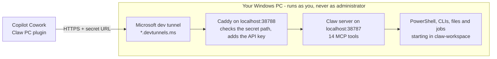

# 🐾 Claw PC for Copilot Cowork

### Let Microsoft 365 Copilot Cowork work on your own Windows PC.

Ask Cowork to run commands and PowerShell, build and test code, read and write files, and run
long jobs on your PC, straight from a Cowork conversation. One script to start it, one plugin
to upload.

**[⬇️ Download](https://github.com/ogradyliam5/copilot-cowork-claw/archive/refs/heads/main.zip)** ·
[Test it](docs/testing.md) · [Troubleshooting](docs/troubleshooting.md) · [Security](docs/security.md)

> [!WARNING]
> While Claw PC is running, Cowork can do anything **you** can do on this PC: read and change
> your files, run programs, and use whatever you're signed in to. So can anyone who gets your
> secret URL. Keep the plugin private, stop Claw PC when you're not using it, and read the
> [security notes](docs/security.md) first.

## What you need

- A **Windows 10 or 11** PC.
- **Microsoft 365 Copilot with Cowork**, and permission to upload your own plugins (in Cowork:
  **Customize → Plugins → Upload plugin**).
- A **Microsoft** (work, school or personal) **or GitHub** account, to sign in to Microsoft dev
  tunnels.

Everything else (PowerShell 7, Node.js, Caddy and the dev tunnel tool) is installed for you.

## Set it up (about 5 minutes)

1. **Download and extract.** [Download the zip](https://github.com/ogradyliam5/copilot-cowork-claw/archive/refs/heads/main.zip),
   right-click it and choose **Extract All**.
2. **Start it.** Open the extracted folder and double-click **`Start-Claw.cmd`**.
   The first run installs what's missing (approve any Windows prompts), asks you to sign in to
   dev tunnels in your browser, builds everything and tests it over the internet. When you see
   **Claw PC is running**, leave the window open.
3. **Upload your plugin.** File Explorer opens with **`claw-pc-plugin-READY.zip`** selected (in
   your Downloads folder). In Cowork, go to **Customize → Plugins → Upload plugin**, choose that
   file, pick **Only you**, then **Apply**. Afterwards, delete the file: it contains your secret URL.
4. **Try it.** Start a **new** Cowork conversation, check **Claw PC** is switched on under
   **Sources**, and ask:

   > On my PC, what versions of Windows, Node and PowerShell do I have?

More to try in [docs/testing.md](docs/testing.md).

## Everyday use

- **Start:** double-click `Start-Claw.cmd` (a few seconds after the first time) and keep the
  window open.
- **Stop:** press **Ctrl+C** or close the window. Cowork can't reach your PC while it's stopped.
- Your PC needs to be awake and online.

For these options, open a terminal in the folder (in File Explorer, right-click inside the
folder → **Open in Terminal**):

| Command | What it does |
| --- | --- |
| `.\Start-Claw.cmd -Rotate` | Makes a new secret URL (the old one stops working). Upload the new plugin it makes. |
| `.\Start-Claw.cmd -Plugin` | Makes the plugin file again, for example if you deleted it before uploading. |
| `.\Start-Claw.cmd -Stop` | Stops a Claw PC that was left running. |
| `.\Start-Claw.cmd -SelfTest` | Tests everything on your PC without opening the tunnel. |
| `.\Start-Claw.cmd -Uninstall` | Deletes your tunnel, keys, logs and server build. |

**Updating:** download the latest zip and extract it over your folder (or `git pull`), then start
as normal. Claw PC rebuilds itself and tells you if the plugin needs uploading again.

## How it works

- **Cowork plugins can't send API keys yet**, so the key stays on your PC. A small local proxy
  (Caddy) only answers on an unguessable secret path, and adds the key itself.
- A **Microsoft dev tunnel** gives Cowork a stable HTTPS address for your PC without opening any
  ports on your router or firewall.
- The **Claw server** gives Cowork 14 tools: `exec`, `powershell`, `fs_read`, `fs_write`,
  `fs_list`, `fs_search`, `fs_op`, `fs_stat`, `job_start`, `job_status`, `job_output`,
  `job_cancel`, `job_list` and `system_info`. Reads run straight away; Cowork asks before
  commands, writes, deletes and jobs.
- The **Claw PC plugin** teaches Cowork how to behave: work in `%USERPROFILE%\claw-workspace`,
  use background jobs for anything slow, stay away from credentials, and ask before system-wide
  changes.

| What | Where |
| --- | --- |
| Keys, tunnel ID, server build and logs | `%LOCALAPPDATA%\claw-pc` |
| Cowork's working folder | `%USERPROFILE%\claw-workspace` |
| Your plugin to upload | `claw-pc-plugin-READY.zip` in your Downloads folder |

## Make your own copy

Fork this repo or use it as a template; you don't need to change anything. Every secret (keys,
secret URL, tunnel and plugin ID) is created on each PC the first time it runs, so nothing
personal ever goes into the repo.

| Path | What it is |
| --- | --- |
| [`Start-Claw.cmd`](Start-Claw.cmd) | Double-click launcher (installs PowerShell 7 if needed) |
| [`claw.ps1`](claw.ps1) | Sets up, starts and tests Claw PC, and builds your plugin |
| [`plugin/`](plugin) | The Cowork plugin: the connector and the `claw-pc` skill |
| [`server/`](server) | The Claw MCP server (Node.js and TypeScript) |
| [`docs/`](docs) | Testing, troubleshooting and security |

Every change is tested on Windows by [CI](.github/workflows/ci.yml), which runs
`claw.ps1 -SelfTest`.

## License

[MIT](LICENSE) © 2026 Liam O'Grady. The server is adapted from copilot-studio-claw, which runs the
same tools on a dedicated Azure VM for Copilot Studio.
